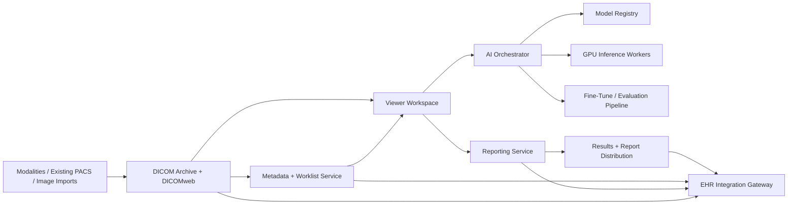

# AI-Native Cloud PACS/RIS Blueprint

This document turns the current imaging prototype in this repo into a broader product direction: an AI-native PACS/RIS that can run in the cloud, integrate with existing EHRs such as Epic, support local deployment, and let users invoke or fine-tune imaging models on their own data.

## Product Thesis

Build a radiology operating system rather than a bolt-on AI button:

- The viewer lives inside the worklist and reporting workflow.
- AI outputs become first-class clinical artifacts, not screenshots or side notes.
- Open-source and commercial models are indexed behind one execution layer.
- Institutions can keep data local and still get the same product surface.
- Fine-tuning, evaluation, and promotion of models happen inside governed workflows.

## What The Current Repo Already Gives Us

The existing app is a narrow but useful seed:

- FastAPI backend for imaging workflows
- Basic study creation and storage
- Slice-by-slice web viewer with editable masks
- Segmentation service abstraction
- Simple model training and scoring flow

It is not yet a PACS/RIS. It lacks a DICOM archive, worklists, reporting, EHR context launch, audit controls, AI governance, multi-user workflows, and production deployment boundaries. But the current segmentation and model orchestration code can become the first AI service layer.

## Core User Experience

The product should feel like one workstation with five tightly connected surfaces:

1. Study worklist
2. Embedded DICOM viewer
3. Reporting workspace
4. AI command palette and results tray
5. Model management and fine-tuning console

The key UX principle is that a radiologist should never need to leave the read path to invoke AI, review AI outputs, accept or reject edits, and insert structured findings into the report.

## Target Architecture

## Recommended Platform Decomposition

### 1. Imaging Archive Layer

Responsibilities:

- Ingest DICOM via DIMSE and DICOMweb
- Store instances, study metadata, derived objects, and non-image artifacts
- Expose QIDO-RS, WADO-RS, and STOW-RS endpoints
- Maintain study, series, and instance lineage

Recommended starting point:

- Use an existing archive such as Orthanc for fast iteration or dcm4chee for a heavier archive/VNA path.
- Keep the archive separate from the application control plane so the viewer and AI services can evolve without becoming the archive.

### 2. Worklist and Metadata Service

Responsibilities:

- Normalize study metadata from DICOM, orders, and EHR context
- Power reading queues, assignment, status, priority, SLA timers, and report state
- Track accession number, MRN, encounter, modality, body part, site, and routing state

Implementation note:

- This should live in Postgres and not depend on querying the DICOM archive for every UI action.
- The DICOM archive remains source-of-truth for image objects; the worklist database is source-of-truth for workflow state.

### 3. Embedded Viewer Workspace

Responsibilities:

- Diagnostic viewing, hanging protocols, annotations, measurements, comparisons, segment review
- Context-preserving transition from worklist item to viewer to report
- Overlay native AI outputs and let users accept, revise, or discard them

Recommended direction:

- Replace the custom canvas viewer with an OHIF-based workstation embedded in the app shell.
- Keep your own app frame around the viewer so worklist, reporting, audit actions, and AI controls stay product-owned.

### 4. Reporting Service

Responsibilities:

- Structured and free-text reporting
- AI-to-report insertion with provenance
- Findings library, macros, templates, impression drafting, and sign-off states
- Version history and attending/resident workflows

Important product rule:

- AI must write into a reviewable draft layer, never silently into the final report.
- Every inserted statement should preserve model version, prompt or task, timestamp, and approval status.

### 5. AI Registry and Orchestrator

Responsibilities:

- Index available models across open-source and internal sources
- Route tasks to the right model based on modality, anatomy, task, and tenant policy
- Handle execution, caching, retries, timeouts, provenance, and cost tracking

Each model entry should include:

- `model_id`
- task type: segmentation, detection, classification, report draft, retrieval, triage
- supported modality/body region
- required pre-processing
- output type: DICOM SEG, DICOM SR, JSON, report text, embeddings
- license and usage restrictions
- validation status
- runtime requirements
- tenant visibility

The orchestrator should not expose raw arbitrary model execution to end users. Users should trigger vetted tasks from a governed catalog.

### 6. Fine-Tuning and Evaluation Layer

Responsibilities:

- Cohort selection
- Labeling and QA workflow
- Training job execution
- Offline evaluation
- Shadow deployment
- Controlled promotion into production

Suggested lifecycle:

1. Select a cohort from local studies or de-identified exports.
2. Create or import labels, including accepted radiologist edits to AI segmentations.
3. Train a tenant-scoped model variant.
4. Evaluate on locked validation sets with site-specific metrics.
5. Run shadow inference on live traffic without affecting reports.
6. Promote only after governance approval.

Fine-tuned models should remain tenant-scoped by default and should not become globally available without explicit curation.

### 7. EHR / RIS Integration Gateway

Responsibilities:

- Launch the app in clinical context
- Pull patient, encounter, order, and report context
- Push status, results, reports, and links back to the EHR
- Keep viewer and EHR session context synchronized

Recommended integration pattern:

- SMART on FHIR for launch and auth
- FHIR resources for patient, encounter, order, report, and image metadata exchange
- HL7 v2 where the site still relies on ADT/ORM/ORU messaging
- FHIRcast for context synchronization across EHR and imaging workspace where supported
- CDS Hooks later for AI-driven workflow nudges, not as the first integration milestone

For Epic specifically, design around standards first and keep Epic-specific behavior inside a thin integration adapter.

## Clinical Artifact Strategy For AI Outputs

This is one of the most important parts of the product.

### Segmentation Tasks

Store outputs as:

- DICOM SEG for voxel-level segmentations
- Optional derived overlays in the viewer cache for fast display
- Review status, editor, and accepted geometry lineage in app metadata

### Measurements And Structured Findings

Store outputs as:

- DICOM SR when the output is a measurement or CAD-like structured result
- App-native JSON for internal workflow state
- Report insertions linked back to the source AI artifact

### Report Assistance

Store outputs as:

- draft suggestions
- cited evidence anchors to regions, measurements, or prior reports
- acceptance and edit history

The product should treat AI output as a first-class derived study artifact with provenance, not as ephemeral text.

## Local Hosting And Deployment Modes

The same product should support three deployment patterns:

### Cloud-Hosted

- Multi-tenant control plane
- Managed object storage
- Central model registry
- Isolated tenant compute

### Hybrid

- Cloud control plane
- Local DICOM edge node
- Local GPU workers for PHI-constrained inference and fine-tuning

### Fully Local

- On-prem Docker Compose or Kubernetes
- Local object store, Postgres, archive, queue, and GPU workers
- Optional air-gapped model registry mirror

Architecturally, this means:

- No hard dependency on public cloud storage APIs inside core services
- Queue, storage, and model backends must be swappable
- Viewer and control plane should function with private endpoints only

## Security, Compliance, And Governance Requirements

This product lives in a high-trust environment, so these are table stakes:

- SSO and role-based access controls
- Full audit trail for study access, AI invocation, edits, and report sign-off
- Tenant isolation for data, models, prompts, and logs
- PHI-safe observability with redaction
- Model provenance, approval state, and rollback
- Clear separation between research models and clinically approved models
- Dataset lineage for all fine-tuning jobs
- Retention and deletion policies by tenant/site

## Suggested Domain Model

At minimum, define these application entities:

- `Patient`
- `Encounter`
- `Order`
- `Study`
- `Series`
- `Instance`
- `WorklistItem`
- `Report`
- `AiTask`
- `AiArtifact`
- `Model`
- `ModelVersion`
- `Dataset`
- `TrainingRun`
- `Deployment`
- `AuditEvent`

The current repo mostly operates at the `Study` level. A PACS/RIS platform needs explicit workflow entities like `WorklistItem`, `Report`, `AiTask`, and `AiArtifact`.

## MVP Build Sequence

### Phase 1: Reading Workspace

- DICOM archive integration
- Study metadata index
- Viewer embedded inside a worklist
- User auth and audit
- Draft report editor

### Phase 2: AI-Native Reporting

- Model registry
- Inference queue and GPU workers
- AI command palette
- DICOM SEG and DICOM SR persistence
- Accepted AI findings inserted into report drafts

### Phase 3: EHR Integration

- SMART on FHIR launch
- Patient and encounter context sync
- Result/report push-back
- Site-specific Epic adapter layer

### Phase 4: Local Fine-Tuning

- Dataset builder from accepted edits and curated labels
- Training job scheduler
- Evaluation dashboards
- Shadow deployment and promotion workflow

## Immediate Next Steps For This Repo

If we use this codebase as the seed, the next practical steps are:

1. Introduce a real study/worklist metadata model in Postgres.
2. Put a DICOM archive behind the app instead of storing only local NIfTI files.
3. Replace the custom canvas viewer with an embeddable diagnostic viewer.
4. Convert segmentation outputs from NIfTI masks into DICOM SEG plus app metadata.
5. Add an AI task table and background job runner for asynchronous model execution.
6. Add a basic report draft editor tied to each study.
7. Split the current single-process backend into control-plane APIs and worker services.

## Standards References

- DICOMweb is the DICOM standard for web-based medical imaging and provides RESTful access patterns suitable for modern viewers and services.
- FHIR `ImagingStudy` can reference DICOM study identifiers and endpoint services such as WADO-RS.
- Epic publicly documents SMART on FHIR, FHIR resources, CDS Hooks, and FHIRcast support as major interoperability entry points.

Useful references:

- DICOMweb: <https://www.dicomstandard.org/using/dicomweb>
- FHIR ImagingStudy: <https://hl7.org/fhir/imagingstudy.html>
- Epic interoperability overview: <https://open.epic.com/TechnicalSpecifications>
- Epic FHIR interface overview: <https://open.epic.com/interface/FHIR>
- OHIF docs: <https://docs.ohif.org/>
